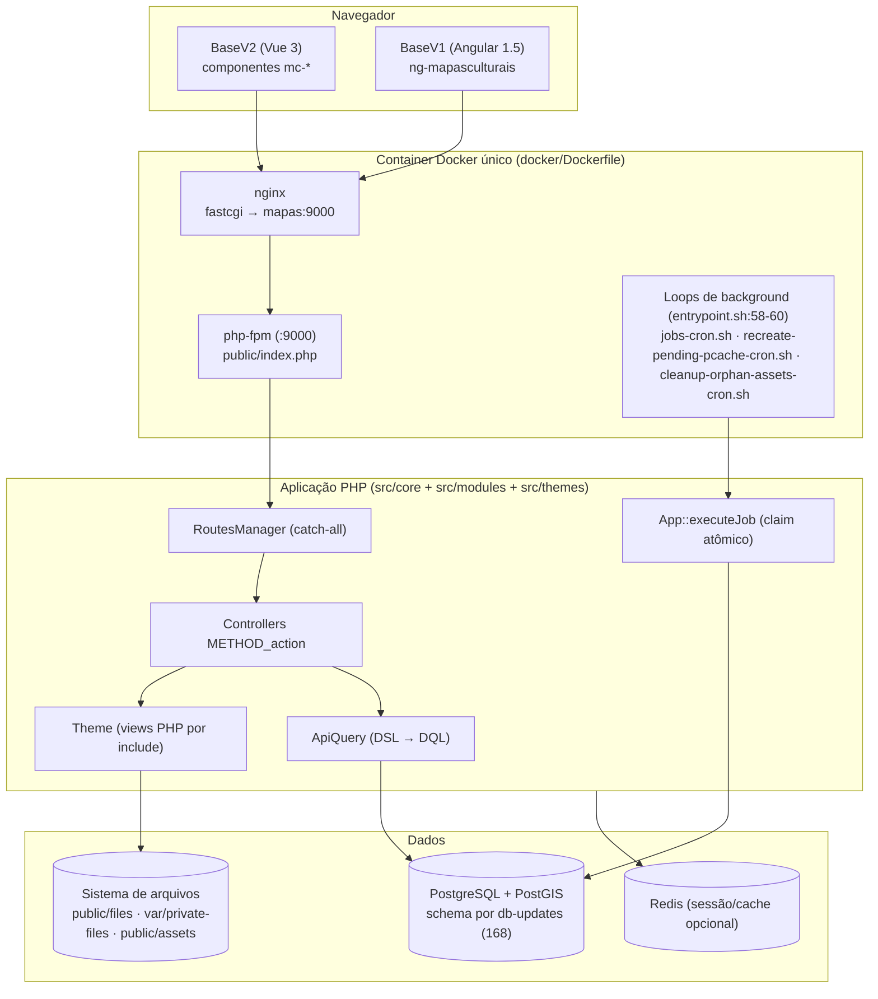
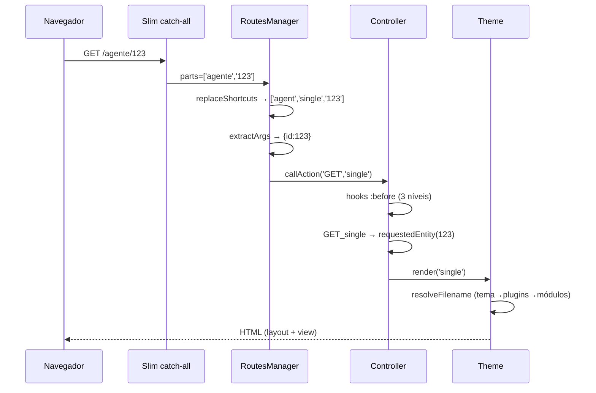
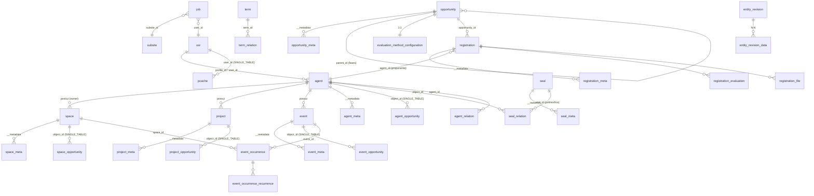
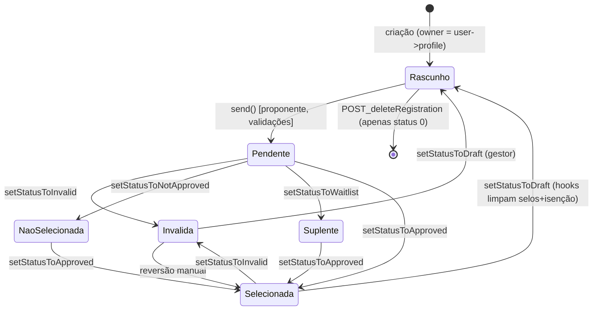
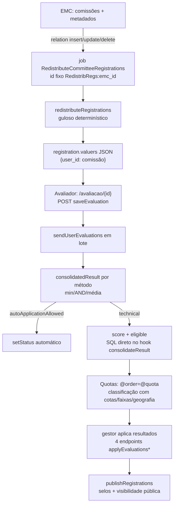

# Arquitetura do Mapas Culturais — referência rastreada por execução

> **Propósito:** documento de referência (Diátaxis: REFERENCE) da arquitetura interna do Mapas Culturais, derivado de análise estática independente do código (rodadas r1–r7, 2026-08). Cada afirmação não-trivial mantém a evidência `arquivo:linha` herdada das análises-fonte (`.mesa/sessions/202608180036_fedb_mapasculturais-analise-zero-docs-profundas/analyses/`). Números de linha referem-se ao working tree da data da análise e podem deslocar com commits.

**Como ler este documento:** cada seção descreve um mecanismo central como "o que acontece quando X", com o caminho real arquivo→linha→efeito. Não é tutorial; consulte as seções por necessidade. Documentos irmãos: [PRD as-built](prd.md) (requisitos de produto) e [Jornadas](jornadas.md) (fluxos de usuário rastreados).

---

## 1. Visão geral e contêineres (C4 nível 2)

O Mapas Culturais é um **monólito PHP 8.3 modular** (Slim 4 + Doctrine ORM 2.16 + PostgreSQL/PostGIS), multi-instalação (50+ instâncias derivadas com plugins/temas próprios), com duas gerações de tema coexistindo (BaseV1/Angular 1.5 e BaseV2/Vue 3), fila de jobs no próprio PostgreSQL e multi-tenant por domínio (subsites).



Fatos estruturais com evidência:

- **Container único multi-propósito**: web-server e workers no mesmo container; os três loops de background sobem via `nohup` no entrypoint (`docker/entrypoint.sh:58-60`); marcador `/mapas-ready` (`:63`) não tem consumidor no repo.
- **Deploy = boot**: `entrypoint.sh:33-34` roda `scripts/db-update.sh` (2 passadas) + `scripts/mc-db-updates.sh` em todo start; schema converge no boot.
- **CI build-only**: `.github/workflows/ci.yml` tem um único job `docker` (build/push de imagem); nenhum workflow roda phpunit/lint (ver [PRD — riscos](prd.md)).
- **Sem compose de produção no repo**: README recomenda o repositório externo "Base Project" (`README.md:82-85`); homologação via `develop.yml` faz `kubectl set image` em cluster externo (`.github/workflows/develop.yml:74-84`).

---

## 2. Bootstrap e inicialização

### 2.1 O caminho até `App::init`

1. `public/index.php:2-3` — `require 'bootstrap.php'` (que é `public/bootstrap.php`) e `$app->run()`.
2. `public/bootstrap.php:2` — requer `src/bootstrap.php`.
3. `src/bootstrap.php` — define constantes de caminho (`PROTECTED_PATH` :11, `PUBLIC_PATH` :12, `APPLICATION_PATH` :14, `THEMES_PATH` :16, `PLUGINS_PATH` :17, `MODULES_PATH` :18, `CONFIG_PATH` :21), constantes de tempo (:4-9), sessão (timeout :27; Redis opcional :28, 54-58 quando `SESSIONS_SAVE_PATH` começa com `tcp://`), normalização HTTPS atrás de proxy (:40-44) e carrega o autoloader do Composer (:66).
4. `public/bootstrap.php:4-10` — carrega `src/conf/config.php` (mergeia todos os `.php` de `config/` e `config/*.d/` — `src/conf/config.php:5-22`), carrega `src/load-translation.php` (detecção de idioma por header do browser vs. `app.lcode`) e, se `Content-Type: application/json`, decodifica `php://input` para `$_POST` (:12-18 — **armadilha**: qualquer POST JSON vira `$_POST` global).
5. `public/bootstrap.php:20-21` — `App::i('web')` (singleton, `src/core/App.php:323`) e `App::init($config)`.

### 2.2 `App::init()` — os 24 passos na ordem exata (`src/core/App.php:453-531`)

| # | Passo | Evidência (App.php) | Efeito |
|---|-------|---------------------|--------|
| 1 | `parseConfig` | :455; impl. :411 | merge/normalização da config |
| 2 | middlewares Slim | :460-462 | ex.: `Apps\Middleware\JWTAuthMiddleware` (`config/middlewares.php`) |
| 3 | `RKA\Middleware\IpAddress` | :465 | IP real atrás de proxy |
| 4 | `session_start()` | :471-472 | sessão PHP (arquivo ou Redis) |
| 5 | offline check | :474-485 | redirect 307 se `app.offline` |
| 6 | validadores Respect\Validation customizados | :488-495 | namespace `MapasCulturais\Validators\*` |
| 7 | `_initLogger` (Monolog) | :497; impl. :580-652 | handlers file/error_log/browser/telegram; QueryLogger opcional (:643-651) |
| 8 | `_initAutoloader` | :498; impl. :659-758 | varre `src/modules/*/Module.php` e `src/themes/*/Theme.php` e registra namespaces (:664-704); `spl_autoload_register` resolve módulos, plugins (subpastas Controllers/Entities/Repositories/Jobs — :713-739) e proxies Doctrine (:709-711) |
| 9 | `_initCache` | :499; impl. :766-798 | `app.cache`, `app.mscache` (namespace "MS"), `rcache` (ArrayAdapter em memória por request) |
| 10 | `_initDoctrine` | :500; impl. :815-971 | annotations dos Entities do core; funções DQL espaciais (CrEOF + customizadas `src/core/DoctrineMappings/Functions/`); tipos custom (`Frequency`, `Point`, `Geography`, `Geometry` — :958-966); `initEntityManager` (:978-1010) cria conexão PDO-pgsql |
| 11 | `_initSubsite` | :502; impl. :1017-1054 | resolve o tenant por `HTTP_HOST` contra `Subsite.url`/`aliasUrl` (:1032-1040); registra hook `app.init:after` que aplica `applyApiFilters()`/`applyConfigurations()` do subsite (:1048-1053) |
| 12 | `_initRouteManager` | :504; impl. :1282-1285 | instancia `RoutesManager` |
| 13 | `_initAuthProvider` | :505; impl. :1060-1077 | registra providers OpenID/logincidadao/authentik; instancia o da config `auth.provider` e chama `setCookies()` (:1074) |
| 14 | `_initAssetManager` | :507 | FileSystem por padrão |
| 15 | `_initTheme` | :508; impl. :1099-1130 | se há subsite, tema = `{subsite->namespace}\Theme` e o **namespace de cache ganha sufixo `:{subsiteId}`** (:1101-1110); senão tema = `themes.active`; merge de `conf-base.php`/`config.php` do tema na config global (:1119-1127) |
| 16 | hook `app.init:before` | :510 | |
| 17 | `_initPlugins` | :512; impl. :1200-1257 | percorre `config['plugins']`, chama `preInit()` estático imediatamente (:1235) e **delega a instanciação para um hook em `app.modules.init:after`** (:1243-1255) — plugins instanciam DEPOIS dos módulos; `DISABLE_PLUGINS=1` pula tudo (:1204) |
| 18 | `_initModules` | :513; impl. :1152-1190 | varre `MODULES_PATH`, **ordena alfabeticamente** (:1170), hooks `app.module({$module}).init:before/after`; instancia `{Module}\Module($config)` — o construtor de `Module` (`src/core/Module.php:48-82`) registra hooks de path no tema, adiciona `Entities/` ao driver Doctrine (:73-77) e chama `_init()` |
| 19 | hook `mapasculturais.init` | :515 | momento em que módulos/plugins registram extensões (construtor de `Module` engancha com prioridade 50 para plugins / 200 para módulos — `Module.php:55-69`) |
| 20 | `register()` | :518 | ver §2.3 |
| 21 | `view->init()` | :521 | chama `Theme::_init()` com hooks `theme.init:before/after` (`Theme.php:274-279`) |
| 22 | `_initStorage` | :523 | driver `storage.driver` ou FileSystem |
| 23 | `_dbUpdates()` | :525-527 | se `DB_UPDATES_FILE` definido (somente CLI db-update), aplica updates pendentes |
| 24 | hook `app.init:after` | :529 | subsite aplica filtros/config aqui (passo 11) |

Depois, `$app->run()` (`App.php:549-573`): hooks `mapasculturais.run:before`, `$this->slim->handle($request)` (:558), emite a resposta e **`persistPCachePendingQueue()` (:567)** — a fila de recriação de permissões da requisição é persistida ao FINAL do ciclo, não no flush.

> **Nota:** módulos são instanciados em ordem alfabética de diretório (`App.php:1170`) — dependência entre módulos NÃO é declarável; a ordem é acidental do nome do diretório (lacuna: não há mecanismo de dependência explícita).

### 2.3 `App::register()` (`App.php:3125-4230`)

Registra, nesta ordem (docblock :3100-3113): 23 controllers do core (:3137-3230 — inclusive `panel` **condicionado ao tema ser BaseV1**, :3140-3145; sob BaseV2, quem registra `panel` é o módulo Panel — `src/modules/Panel/Module.php:26`), 5 saídas de API (:3232-3236), roles `saasSuperAdmin > saasAdmin > superAdmin > admin` (:3238-3300), ~30 `FileGroup`s com regex de mime (:3307-3509), metalist groups (:3596-3650), job type core `ReopenEvaluations` (:3653), **tipos e metadados por entidade** lidos de `src/conf/*-types.php` (:3657-4062 — resolvidos pela hierarquia de paths do tema, `view->resolveFilename`), taxonomias (:4064-4111) e, por fim, `view->register()`, `modules->register()` e `plugins->register()` (:4113-4121).

### 2.4 Ordem de caminhos do tema (por que tema > plugin > módulo)

`Theme::resolveFilename($folder, $file)` itera `$this->path` **na ordem de inserção** e devolve o primeiro match (`src/core/Theme.php:742-754`). A ordem deriva da sequência de init:

1. O **tema** registra no construtor o hook `app.modules.init:after` (prioridade 100) que, por reflexão, adiciona o diretório da classe do tema ativo e de cada ancestral até `MapasCulturais\Theme` (`Theme.php:210-220`) — tema filho primeiro.
2. Cada **módulo/plugin** registra no construtor o hook `mapasculturais.init` (módulos prioridade 200, plugins 50 — `Module.php:55-69`).

Como `app.modules.init:after` dispara antes de `mapasculturais.init`, a ordem final é: **tema ativo (e ancestrais, filho→pai) → plugins → módulos (ordem alfabética)**. Consequências: BaseV1 tem views completas e **sombreia** as views dos módulos; BaseV2 quase não tem views e **consome** as views dos módulos; o mesmo mecanismo resolve `assets/` e os `db-updates.php` de módulos/temas (varredura de `$this->view->path` em `App::_dbUpdates`, `App.php:5455-5460`).

---

## 3. Resolução de rota — URL → controller → método → render

### 3.1 O mecanismo (uma única rota catch-all)

Não há rotas nomeadas por pattern no Slim. `RoutesManager::addRoutes()` (`src/core/RoutesManager.php:114-138`) registra **uma única rota** `$slim->any('[/{args:.*}]')` que:

1. Divide o path em partes (:119).
2. Se `parts[0] == 'api'`, marca `$api_call = true` e remove (:121-126).
3. `replaceShortcuts()` (:147-179): compara o prefixo da URL com as chaves de `config['routes']['shortcuts']` e substitui por `[controller, action, params-fixos]`; depois resolve **aliases** de controller e de action via `config['routes']['controllers']` / `['actions']` (:169-176 — ex.: alias `painel => panel`).
4. `extractArgs()` (:194-214): do fim para o início, promove segmentos numéricos para `args['id']` (int) e segmentos `chave:valor` para args nomeados; o restante sobra como args posicionais.
5. `parts[0]` (ou `default_controller_id` = `site`) é o controller; `parts[1]` (ou `default_action_name` = `index`) é a action (:131-132; defaults em `config/routes.php:6-7`).
6. `route()` (:69-107): instancia `MapasCulturais\Request`, resolve o controller pelo id (registry do `registerController`), seta `$app->view->controller` e chama `callAction()`. Exceções mapeadas: `NotFound`→404; `PermissionDenied`→403; `WorkflowRequest`→**HTTP 202 com JSON dos tipos de request pendentes** (:99-104); `Halt`→silêncio (resposta já escrita).

### 3.2 Despacho da action (`Controller::callAction`, `src/core/Controller.php:276-353`)

- Para chamadas web, o "method" é o verbo HTTP; para `/api/...`, é a string literal `API` (`RoutesManager.php:233`).
- Resolução do alvo, em ordem (`Controller.php:305-328`): método `{METHOD}_{action}` (ex.: `GET_single`) → `ALL_{action}` (exceto quando method == `API`) → hooks `ALL({id}.{action})`/`{METHOD}({id}.{action})`. Hooks registrados em controllers são a forma canônica de **módulo adicionar action a controller alheio**.
- Se nem método nem hook existem: `$app->pass()` → 404 (:348-351).
- Antes/depois: cascade de hooks `:before`/`:after` em três níveis (global `GET:before`, do controller `GET(agent):before`, da action `GET(agent.single):before` — :330-347; os hooks `ALL(x.y):before` e `METHOD(x.y):before` disparam **ambos em sequência**).
- `setRequestData` (:219-236) funde urlData + params PSR-7 + parsed body em `$controller->data`.

### 3.3 Exemplos rastreados

**A — Página de entidade: `GET /agente/123`** (fonte: r1-backend §2.3)

1. Catch-all recebe `['agente','123']`; shortcut `'agente' => ['agent','single']` (`config/routes.php:22`) substitui para `['agent','single','123']`.
2. `extractArgs`: `123` é numérico → `args = ['id' => 123]`.
3. `route('agent','single',['id'=>123])` → controller registrado em `App.php:3150` (`registerController('agent', 'MapasCulturais\Controllers\Agent')`).
4. `callAction('GET','single')` → `GET_single` em `Traits/ControllerEntityViews.php:47-65`: `requestedEntity` (`ControllerEntity.php:99-112` — `urlData['id']` → `repository->find(123)`); se Ajax → `$this->json($entity)`, senão → `$this->render('single', ['entity'=>$entity])`.
5. `Controller::render` (`Controller.php:381-391`): hook `controller(agent).render(single)` pode trocar o template; `Theme::render` (`Theme.php:414-428`) escreve no body PSR-7. Se `canUser('view')` falha → 404 (`$app->pass()`).

**B — Endpoint de API: `GET /api/agent/find?@select=id,name&name=ILIKE(fulano*)`** (fonte: r1-backend §2.4)

1. `api` removido, `api_call=true`; `find` é a action → `Controller::callAction('API','find',...)`.
2. `API_find` (`Traits/ControllerAPI.php:237-240`): `$this->apiQuery($this->getData)` → `apiResponse`.
3. `apiQuery` (:42-73): hooks `API.find(agent).params` (mutável) → `new ApiQuery(Agent::class, $params)` → hook `API.query(agent)` → `getFindResult()`; header `API-Metadata` com count/numPages (:122-138); hook `API.find(agent).result`.
4. `ApiQuery` gera DQL com subquery de permissões (§9), executa, hidrata relações/metadata/arquivos em lote (`append*`) e devolve arrays. O formato de saída é selecionado pelo parâmetro `@type` (json default) — **não** por sufixo `.json` na URL (`ControllerAPI.php:80-90`).



**Armadilhas de rota documentadas:** três chaves literais `'inscricao'` idênticas em `config/routes.php:81-83` (`edit`, `single`, `view`) — em array PHP a última vence: o atalho efetivo é `['registration','view']` (o acidente é silencioso porque `GET_view` existe); controller registrado ≠ classe existe: `Opportunities/Module.php:1324-1327` registra `opportunities` apontando para `Opportunities\Controller`, que não existe no repo (URL `/opportunities/*` → 404; o controller efetivo é `opportunity`, singular).

---

## 4. Entidades e ciclo de vida

### 4.1 A hierarquia real de classes

`\MapasCulturais\Entity` (`src/core/Entity.php:59-62`) é uma classe PHP abstrata **sem nenhum mapeamento ORM** — colunas comuns (`id`, `status`, `create_timestamp`, `update_timestamp`) são redeclaradas em cada entidade (ex.: `Agent.php:73-78,132-139`). Só existem **duas** hierarquias SINGLE_TABLE: `pcache` (`PermissionCache`, discriminator `object_type`, 12 subclasses — `PermissionCache.php:18-33`) e `opportunity` (`Opportunity`, discriminator `object_type` — subclasses `ProjectOpportunity`, `EventOpportunity`, `AgentOpportunity`, `SpaceOpportunity`, `Opportunity.php:63-70`; o discriminator É a referência polimórfica ao dono: `AgentOpportunity` mapeia `object_id` como `ManyToOne → Agent`).

Composição por traits (`src/core/Traits/`) — quase cada trait tem tabela satélite correspondente (`<entidade>_<função>`): `EntityMetadata`→`agent_meta`; `EntityFiles`→`agent_file` (herda `file`); `EntityAgentRelation`→`agent_agent_relation` (herda `agent_relation` polimórfica); `EntityTaxonomies`→`agent_term_relation`; `EntitySealRelation`→`agent_seal_relation`; `EntityPermissionCache`→`agent_permission_cache` (herda `pcache`); `EntityOpportunities`→`agent_opportunity`; `EntityRevision`→`entity_revision*` (compartilhada, polimórfica). Tabelas polimórficas (`agent_relation`, `file`, `term_relation`, `seal_relation`, `metalist`, `pcache`, `request`) guardam `object_type` (enum PG com FQCNs PHP) + `object_id` **sem FK** — a integridade é garantida por triggers PL/pgSQL `fn_clean_orphans` (`src/db-updates.php:2155-2230`).

### 4.2 ER das entidades centrais



Colunas dignas de nota (fonte: r1-dba §1.5): `Registration.id` **não é sequencial** — `RandomIdGenerator` faz `SELECT pseudo_random_id_generator()` por INSERT (`Registration.php:67-71`; `RandomIdGenerator.php:24-29`; função criada por update `'new random id generator'`, `db-updates.php:145-190`); `number` varchar(24) é o identificador público. `Registration` carrega JSON desnormalizado: `agents_data`, `space_data`, `valuers`, `valuers_exceptions_list`, `editable_fields` (`Registration.php:128-181`). Tabela de usuários chama-se `usr` (`user` é reservado no PG). Coluna `subsite_id` presente em quase toda tabela central.

### 4.3 Status: base e máquina da Registration

Status base (`Entity.php:67-87`): `STATUS_ENABLED=1`, `STATUS_DRAFT=0`, `STATUS_ARCHIVED=-2`, `STATUS_TRASH=-10`, `STATUS_DISABLED=-9`. O mapa de transições RESTful está em `Traits/ControllerEntity.php:36-63` (`$changeStatusMap`: `PUT/PATCH` com `data['status']` aciona publish/unpublish/delete/archive/undelete conforme origem→destino); `setStatus()` verifica permissão por transição (:402-446), dispara hook `entity(X).setStatus({$status})` e enfileira recriação de pcache (:442-444).

A `Registration` sobrepõe com máquina própria (`Registration.php:54-58, 1179-1205`): `0 Rascunho → 1 Pendente(=SENT) | 2 Inválida | 3 Não selecionada | 8 Suplente | 10 Selecionada`. O rótulo de `STATUS_SENT` é "Pendente" porque, do ponto de vista do gestor, a inscrição enviada aguarda avaliação. `RegistrationEvaluation` tem máquina própria: `DRAFT=0`, `EVALUATED=1`, `SENT=2` (`RegistrationEvaluation.php:46-47`).



> **Não há guarda de exclusividade de transição** — qualquer status salta para qualquer outro com permissão `changeStatus` (`_setStatusTo` só verifica permissão, `Registration.php:1060-1074`); as setas são as observadas nos callers. A primeira transição de rascunho só pode ser 1 (`'First status change should be pending'`, `Controllers/Registration.php:539`). Gatilhos de transição (fonte: r1-senior §1.2): `send()` do proponente; decisão do gestor (`POST_setStatusTo`); auto-aplicação por método de avaliação (`applyConsolidatedResult`, quando `autoApplicationAllowed`); aplicação em massa por método; invalidação por exequibilidade majoritária (`forceSetStatus`, bypass de permissão); isenção por selos (`grantExemption`); sincronização entre fases; retorno a rascunho. Cada `setStatusTo*` dispara hook `entity(Registration).status({nome})` (`Registration.php:1224-1268`) — a espinha dorsal da extensibilidade do domínio.

**Rótulos por contexto:** a mesma constante tem rótulo distinto por tipo de fase — 3 = "Não selecionada" (avaliação) / "Indeferido" (recurso) / "Reprovado" (prestação final); 10 = "Selecionada" / "Deferido" / "Aprovado" (`EvaluationMethodContinuous/Module.php:34-66`; `OpportunityPhases/Module.php:2411-2436`).

### 4.4 `Entity::save()` — ordem exata (`Entity.php:1189-1285`)

1. Checagem de lock (:1196-1202) — `PermissionDenied` se outro usuário locked.
2. Coleta de `WorkflowRequest`s: hooks `entity(X).save:requests` (:1205-1206) e `_saveNested`/`_saveOwnerAgent` (:1204-1225).
3. `checkPermission('create'|'modify')` (:1227-1239); subsite de origem setado na criação (:1231-1234).
4. Hooks `entity(X).save:before` → `em->persist` → `entity(X).save:after` (:1241-1243) — **`save:after` é pré-flush** (:1261-1263): não significa "no banco".
5. Metadados (`saveMetadata`), termos (`saveTerms`), revisão (`_newCreatedRevision`/`_newModifiedRevision`) (:1245-1259).
6. `$flush` → `em->flush()` (:1261-1263).
7. `PermissionDenied` engolida se há workflow requests pendentes (:1265-1268) — lança `Exceptions\WorkflowRequest` agregada (:1270-1275) → RoutesManager converte em **HTTP 202**.
8. Hooks finais `entity(X).insert:finish`/`update:finish`/`save:finish` (:1277-1283) — **fora do `if($flush)`**: com `save(false)` os hooks `:finish` disparam sem dado persistido (bug documentado, §4.6).

**Persist × Save (armadilha canônica):** `em->persist()` sozinho dispara os callbacks Doctrine (`prePersist` etc., `Entity.php:1587-1721`, que mapeiam para `entity(X).insert|update:before/:after`, recompute de changesets, `updateTimestamp` automático, seed de pcache no postPersist :1623-1626, `clearPermissionCache` no postUpdate :1720) apenas no `flush()`. `Entity::save()` é a API de domínio que acrescenta permissão, workflow, metadados, termos, revisão e hooks `save:*`. Chamar `persist` cru pula todo o ciclo de domínio.

### 4.5 Catálogo de lifecycle hooks (fonte: r3-backend §2)

Convenção: `{X}` = hook class path da entidade (`Entity::getHookClassPath`, `Entity.php:1104-1110`). Todos os hooks abaixo são **bound** (`applyHookBoundTo`, `Hooks.php:256`): dentro do callback, `$this` é a entidade/controller alvo.

**Backed por callbacks Doctrine** (`Entity.php`):

| Hook | Disparo | Semântica |
|---|---|---|
| `entity({X}).insert:before` | `prePersist` (:1594) | computeChangeSets roda antes e depois (:1590, :1596) — mudanças feitas no hook entram no changeset |
| `entity({X}).insert:after` | `postPersist` (:1621) | pós-INSERT no banco (dentro do flush); semeia pcache do owner + enqueue (:1623-1626) |
| `entity({X}).update:before` | `preUpdate` (:1686) | recompute changesets; atualiza `updateTimestamp` aqui (:1690-1692) |
| `entity({X}).update:after` | `postUpdate` (:1718) | pós-UPDATE; `clearPermissionCache()` do prefixo canUser (:1720) |
| `entity({X}).remove:before` | `preRemove` (:1643) | antes do DELETE |
| `entity({X}).remove:after` | `postRemove` (:1660) | após DELETE; `deletePermissionsCache()` (:1662-1664) |

**Orquestração de `Entity::save()`**: `save:requests` (×2 disparos, :1205-1206), `save:before` (:1241), `save:after` (:1243, pré-flush), `insert:finish`/`update:finish` (:1277-1281, pós-flush se `flush=true`), `save:finish` (:1283).

**Operações de soft-lifecycle** (traits):

| Operação (trait) | Hooks | Evidência |
|---|---|---|
| `publish()` / `unpublish()` (EntityDraft) | `.publish:before/:after` / `.unpublish:before/:after` | EntityDraft.php:30,40,50,60 |
| `archive()` (EntityArchive) | `.archive:before/:after` | EntityArchive.php:31,41 |
| `unarchive()` | `.unarchive:before` + **`.unarchive:before` de novo — BUG: `:after` nunca dispara** | EntityArchive.php:50 e 67 |
| `delete()` (EntitySoftDelete = lixeira) | `.delete:before/:after` | EntitySoftDelete.php:48,58 |
| `undelete()` | `.undelete:before/:after` | EntitySoftDelete.php:78,94 |
| `destroy()` (hard delete) | `.destroy:before/:after` | EntitySoftDelete.php:112,118 |
| `setStatus($status)` | `.setStatus({$status})` com `&$status` mutável | Entity.php:438-440 |

**Domínio Registration**: `entity(Registration).status({draft|sent|invalid|notapproved|waitlist|approved})` (cada `setStatusTo*`, `Registration.php:1224-1268`); `entity({X}).send:before/:after` (`send()` :1274, :1292); `entity(RegistrationEvaluation).setStatus(<<*>>)`; `entity(Registration).consolidateResult` (contém o bug `nexPhase`, §14.3).

**Satélites**: `entity({owner}).meta({key}).insert/update/remove:before/:after` — callbacks dedicados em **cada** classe `*Meta` (ex.: `AgentMeta.php:40-61`) e na base polimórfica (`Metadata.php:84-115`); a base `EntityMetadata` NÃO define esses callbacks — criar `{X}Meta` novo exige copiar o bloco (boilerplate duplicado). `entity({owner}).file({group}).insert/remove/update:before/:after` (`File.php:512-553`; `$_hook_class` = classe do owner).

**Leitura/schema/permissão**: `entity({X}).get({name})` (MagicGetter.php:57-62 — **só se a entidade optou in** via `$__enableMagicGetterHook`, `Entity.php:114`; opt-ins verificados: App, Agent, Event, Opportunity, Project, Registration, Seal, Space, Subsite, EvaluationMethodConfiguration); `entity({X}).jsonSerialize` (:1409); `entity({X}).propertiesMetadata` (:976); `entity({X}).validations` (:1486); `entity({X}).validationErrors` (:1547); `entity({X}).statusesNames` (:364); `can({classPath}.{action})` + `entity({X}).canUser({action})` (:668-669 — sobrescrevem resultado de permissão); `entity({X}).permissionsList`/`.pcachePermissionsList` (:830, :853); `entity({X}).permissionCacheUsers` (EntityPermissionCache.php:89); `entity({X}).recreatePermissionCache:before/:after` (:232, :282 — em volta da recriação recursiva); `entity({X}).saveOwnerAgent` (EntityOwnerAgent.php:100).

### 4.6 Bugs de lifecycle conhecidos

1. **`unarchive:after` nunca dispara; `unarchive:before` dispara 2×** — `EntityArchive.php:50` e `:67` (a linha 67 repete o nome `:before`). Consumidor de `unarchive:after` silenciosamente morto.
2. **`save:finish`/`insert:finish` com `flush=false` disparam sem dado persistido** — os hooks fim (`Entity.php:1277-1283`) estão fora do `if($flush)` (:1261-1263).
3. **Bug `nexPhase`** (confirmado pelo dono) — ver §14.3.

### 4.7 Workflow requests — quando o usuário não pode, mas pode PEDIR

Se `App::isWorkflowEnabled()` (`App.php:1719`) e a operação falha por permissão, em vez de `PermissionDenied` o código cria um **Request** dentro de `WorkflowRequestTransport`. Pontos verificados: trocar owner → `RequestChangeOwnership` (EntityOwnerAgent.php:108); aninhar em pai sem `createChild` → `RequestChildEntity` (EntityNested.php:170); criar ocorrência de evento em espaço alheio → `RequestEventOccurrence` (Event.php:277). `Entity::save()` coleta os transports, salva os requests e lança a exceção agregada → **HTTP 202 com JSON `["RequestTypeName",...]`** (`RoutesManager.php:99-104`). `Request::approve()` (:202-218) exige `@control` no destination (:255-266), roda `_doApproveAction()` com access control desligado e dispara `workflow({X}).approve:before/:after`; `reject()` deleta (:220-236). Deduplicação por `requestUid` md5 (:276-299).

### 4.8 O sistema de hooks — semântica e armadilhas

Implementação: `src/core/Hooks.php` + fachada `App.php:2192-2240`.

- **Registro** `Hooks::hook($name, $callable, $priority=10)` (:115-143): suporta múltiplos hooks separados por vírgula (:120); prioridade 0=alta; desempate por ordem de registro via `hookCount/100000` (:116-117) — mesma prioridade executa na ordem de registro (FIFO determinístico); prefixo `-` registra **exclusão** que remove callables de hooks casados (:122-127).
- **Compilação para regex** `_compile` (:320-344): o nome vira `#^preg_quote(nome)$#i` — **case-insensitive** (flag `#i`, :335: `entity(agent)` casa `entity(Agent)` — colisões de nome não óbvias); `*` **só vira wildcard dentro de `<<...>>`** (vira `[^()\:]*`, :338); fora dele, `*` é literal escapado. Padrões reais: `GET(panel.<<*>>):before`, `entity(<<agent|space|event>>)` (`Theme.php:233`; `ApiKeywords/Module.php:71`).
- **Casamento** `getCallables` (:272-312): o nome DISPARADO é testado contra o regex de cada registro; exclusões vencem (:279-283); cache por nome invalidado a cada registro (:119).
- **Execução** `apply`/`applyBoundTo` (:200-263): `Closure::bind($callable, $target)` (:256) — o callback roda com `$this` = objeto alvo. O padrão de mutação é receber `&$var` nos payloads (ex.: `'result' => &$result`) — callback sem `&` não muta.
- **Armadilhas evidenciadas**: (1) wildcard sem `<<>>` falha silenciosamente; (2) registrar hook depois do disparo não pega (hooks de `app.init:*` só veem quem registrou antes — por isso plugins instanciam via `app.modules.init:after`); (3) `clear()` remove por callable identity (:68-90). Semântica executável: `tests/src/HooksTest.php` (ordem de prioridade + wildcard).

---

## 5. Metadados EAV de ponta a ponta

1. **Registro** — `App::registerMetadata(Definitions\Metadata, entity_class, type_id?)` (`App.php:4946-4993`). Se a entidade usa tipos e não veio type, registra para todos (fan-out, :4951-4962) — metadados podem ser por tipo de entidade. **5 canais de registro**: (1) arquivos `*-types.php` (config declarativa resolvida pela hierarquia de paths do tema, `App.php:3657-4062`); (2) tema em runtime (hook `app.register`, `Theme.php:157-162`); (3) módulos/plugins; (4) métodos de avaliação (`EvaluationMethod.php:1948`); (5) `Opportunity::registerRegistrationMetadata()` — para cada `RegistrationFieldConfiguration`, registra metadado em `Registration` em runtime (`Opportunity.php:1648-1767`; `unregisterRegistrationMetadata` :1628-1644). Escrever em metadado não registrado lança exceção `"metadata is not registered"` (`Traits/EntityMetadata.php:328-331`).
2. **Definição** — `Definitions\Metadata` (`Metadata.php:167-225`): key, label, type, `private`, `validations` (strings Respect/Validation + `required`/`unique`), `serialize`/`unserialize` por tipo (boolean/json/object/array/entity/DateTime/multiselect/location/bankFields/municipio — :232-386; hooks `metadata({type}).serializer/unserializer` para estender).
3. **Magic property** — `$entity->chave` → `__metadata__get` (aplica `unserialize`) / `__set` → `__metadata__set` (aplica `serialize` e `setMetadata`) (`Traits/EntityMetadata.php:86-114`). `setMetadata` (:320-362): string vazia → null; busca metadata existente; registra em `__changedMetadata`; **recompute manual do changeset Doctrine** (:351-356) para o UnitOfWork perceber a mutação do objeto Meta.
4. **Persistência** — uma tabela `<entidade>_meta` por entidade (11 tabelas: `agent_meta`, `space_meta`, `event_meta`, `project_meta`, `opportunity_meta`, `registration_meta`, `seal_meta`, `subsite_meta`, `usr_meta`, `notification_meta`, `evaluation_method_configuration_meta`), colunas `(id serial, object_id FK CASCADE, key varchar, value text)`. DDL canônico (dump:758-762). Índices: `(object_id)`, `(object_id, key)` (o índice quente), `(key)`, e **unique funcional `(object_id, key)`** criado pelo update `'Aplica indices UNIQUE nas tabelas auxiliares'` (`db-updates.php:1342-1363`) após dedup histórico (:1320-1338). `registration_meta` declara apenas 3 índices + unique (sem o flag fulltext — assimetria real). Escrita custa 1 SELECT por chave (`EntityMetadata` trait :335) + 1 SELECT dedup por INSERT (`src/core/EntityMetadata.php:48-51`) — dedup em duas camadas, herança da era sem constraint.
5. **Tabela genérica `metadata`** (PK composta object_id+object_type+key, `Entities/Metadata.php:12-52`) — o único uso core é o ramo `else` de `Definitions\Metadata::validateUniqueValue` (`Definitions/Metadata.php:473-477`), que é **inalcançável** (todas as 11 entidades com metadata têm classe `*Meta` dedicada) e contém **bug de sintaxe** (`m.ownerType :ownerType` sem o operador `=`). Trate como vestígio quebrado. **Veredito do dono do código (2026-08-19): a tabela `metadata` genérica nunca foi usada — vestigial.**
6. **Hidratação EAGER** — a associação `__metadata` é `fetch="EAGER"` nas entidades centrais (ex.: `Agent.php:213`; Registration é a exceção, LAZY, :184): todo `find()` de Agent carrega todas as suas metas. `getMetadata` faz dedup em leitura deletando a linha de maior id (EntityMetadata.php:234-248) — prova de que duplicatas eram estado real antes do unique.
7. **API e busca** — `jsonSerialize` inclui metadados registrados não-privados (`Entity.php:1370-1381`); `API_describe` expõe o schema completo; filtro por metadado na ApiQuery gera `LEFT JOIN e.__metadata {alias} WITH {alias}.key = '{key}'` (§9); seleção em lote anti-N+1 (`appendMetadata`, `ApiQuery.php:1727-1812`).
8. **Privacidade** — metas `private` cortadas conforme `canUser('viewPrivateData')` (`EntityMetadata.php:133-147`; `ApiQuery.php:1782-1800`).

---

## 6. Permissões e permission cache (pcache)

### 6.1 `canUser` em duas camadas

- `canUser($action,$user)` (`Entity.php:630-677`): cache por request (`{entity}:canUser({uid}):{action}`, :647-650); procuração (`isAttorney`); dispatch: `@control` → `canUser_control` (:575-593: agentRelation com controle, admin, pai aninhado, owner); método `canUser{Action}` se existir; senão `genericPermissionVerification` (:475-500: guest negado, admin ok, owner ok, `userHasControl` ok). Hooks `can(...)`/`entity(X).canUser(...)` podem inverter o resultado (:668-669). `checkPermission` (:754-757) lança `PermissionDenied` → HTTP 403. `App::disableAccessControl()` desliga tudo (:632-634) — usado deliberadamente em migrações/workflows.
- **pcache materializada**: tabela `pcache` (SINGLE_TABLE) com permissões por (user_id, action, object_type, object_id) — INSERT raw SQL com `ON CONFLICT DO NOTHING` (`EntityPermissionCache.php:140-149`). Recreação: `createPermissionsCacheForUsers` (:59-160) calcula usuários com controle (agent relations, owner, extras por hook `entity(X).permissionCacheUsers`) e grava as permissões de `getPCachePermissionsList()` (@control, view, modify + hook). Índice de leitura: `pcache_permission_user_idx (object_type, object_id, action, user_id)` (dump:4181) — o hot path de `canUser` resolve por essa tabela.

### 6.2 A fila de recriação (assíncrona por padrão)

`enqueueToPCacheRecreation` → fila em memória → `persistPCachePendingQueue` (`App.php:2580-2654`) grava na tabela `permission_cache_pending` **com id de `nextval('agent_id_seq')`** (:2618-2623 — a fila "empresta" a sequência de `agent`; a entidade declara `permission_cache_pending_seq`, `PermissionCachePending.php:26` — divergência mapping×SQL real, inócua porque o INSERT é SQL cru). Um enqueue "todos os usuários" cancela enqueues por usuário (:2632-2649). O consumidor é `App::recreatePermissionsCache()` (:2704+): processa por `object_type` com lock otimista por status (claim `UPDATE ... SET status = 1 WHERE object_type=:t AND object_id=:id AND status=0 RETURNING *`, :2760-2768), em lotes de `pcache.maxEntitiesPerProcess` (default 25, `config/pcache.php`); **erro → `status=2`** e a linha fica invisível ao consumidor (o resumo lê `status in (0,1)`, :2712-2717) — estacionada até intervenção manual (`scripts/recreate-pcache.sh`, `recreate-pending-pcache.sh`). O cron dedicado roda com `renice +19`/`ionice -c3` (baixa prioridade deliberada, `docker/recreate-pending-pcache-cron.sh:11-12`). Se `app.recreateCacheImmediately` (`config/0.main.php:52`, default false), a recriação é síncrona.

> **Armadilha operacional:** permissão recém-alterada sem processar a fila resulta em permissão velha até o worker rodar. Em testes, o par obrigatório é `TestCase::processPCache()` (`tests/src/Abstract/TestCase.php:97-108`) + `Builder::save()` que chama `persistPCachePendingQueue` (`tests/src/Abstract/Builder.php:32-38`).

**401 × 403:** `requireAuthentication` (`Controller.php:455-463`; `AuthProvider.php:128-147`) → AJAX/JSON responde 401, senão redirect 302 para auth; `checkPermission`/`PermissionDenied` → 403 (`RoutesManager.php:94-97`). Matriz executável: `tests/src/RoutesTest.php:105-347`.

---

## 7. Autenticação, sessão e subsite (multi-tenant por URL)

### 7.1 AuthProvider

- Abstrato em `src/core/AuthProvider.php`; `_initAuthProvider` (`App.php:1060-1077`) registra providers `OpenID`, `logincidadao`, `authentik` e instancia o da config `auth.provider` — o valor ativo do repo é `'\MultipleLocalAuth\Provider'` (plugin externo, `config/authentication.php:9`; o bloco com `Fake` nas linhas 3-7 está **comentado**); testes usam `Test` (`tests/config.d/auth.php`).
- Contrato: `_getAuthenticatedUser`, `_cleanUserSession`, `_createUser`, `processResponse`. `getAuthenticatedUser` (:211-225) devolve `GuestUser` se não autenticado e faz **logout automático + `PermissionDenied` se `status < 1`** (:218-221).
- Cookies legíveis pelo frontend `mapasculturais.uid`/`.adm` (:242-249). Hook `auth.login` pós-login; `auth.successful` atualiza `lastLoginTimestamp` (:50-60); `createUser` (:87-106) cria User+Agent, pcache inicial e e-mail de boas-vindas.
- Middleware adicional para apps externas: `Apps\Middleware\JWTAuthMiddleware` (`config/middlewares.php`; módulo Apps com `UserApp` + JWTAuthProvider).

### 7.2 Sessão

PHP sessions com `session.save_handler` redis se `SESSIONS_SAVE_PATH` começa com `tcp://` (`src/bootstrap.php:28, 54-58`); lifetime `SESSION_TIMEOUT` default 12h (:27, 60-61); `session_start` em `App::init` (`App.php:471-472`).

### 7.3 Subsite

- **Resolução por domínio**: `_initSubsite` (`App.php:1017-1054`) consulta `Subsite` por `url` ou `aliasUrl` (com `status=1`). Um único banco; tenants separados por domínio (índices `url`, `alias_url`).
- **Efeitos do tenant ativo**: (a) namespace do cache `app.cache.namespace:{subsiteId}` (:1101-1105); (b) tema próprio `{namespace}\Theme` (:1106-1110); (c) em `app.init:after`, `applyApiFilters()` injeta filtros obrigatórios em todas as queries da API a partir de metadados `filtro_{controller}_{tipo}_{meta}` do subsite (`Subsite.php:259-310` — gera `IN(...)`/`IIN(...)`; implementado como ApiQueries penduradas por hook `ApiQuery({id}).params`, :305-314, + `filter_subsite_{entidade}` → `_subsiteId = EQ(id)`, :317-322) e `applyConfigurations()` sobrescreve a config (:337-404, hooks `subsite.applyConfigurations:before/:after`); (d) `baseUrl` do App vira a URL do subsite (`App.php:1381-1388`); (e) `isUserAdmin` pode exigir role no subsite (`usesOriginSubsite`, `Entity.php:731-737`); (f) jobs de subsite re-executam init de tema/config no worker (`App.php:2474-2498`).

---

## 8. Jobs — fila no PostgreSQL

### 8.1 Tabela e enfileiramento

Tabela `job` (criada 2021-04-12, commit `3a5f7dffd`, issue #1772): `name` (slug do tipo), `iterations` (0 = infinito), `iterations_count`, `interval_string` (formato `strtotime`), `next_execution_timestamp`, `last_execution_timestamp`, `metadata json`, `status` (0=waiting/1=processing; `Job.php:32-33`), `subsite_id`, `user_id`; PK surrogate `pk` + `id varchar` deduplicadora (`Job.php:36-51`). Índices casados com o pop: `job_next_execution_timestamp_idx` e `job_search_idx (next_execution_timestamp, iterations_count, status)` (`Job.php:22-25`).

`App::enqueueJob` (`App.php:2288-2390`): valida o tipo contra os `JobType` registrados; **id determinístico** = `md5("{slug}:{dados}:{start}:{interval}:{iterations}")` (`Definitions/JobType.php:45-49`) — o id É a deduplicação; se já existe job com o mesmo id, retorna o existente, **exceto** se está `PROCESSING` há mais de 5 min (sobre `createTimestamp`, `App.php:2340-2342`) **e** `iterations == 1` — nesse caso deleta e recria (:2333-2355; o único "anti-zombie", e jobs recorrentes NÃO se recuperam sozinhos); `replace=true` → `DELETE FROM job WHERE id = ?` (:2327-2330). Payload em `metadata` (json) com entidades serializadas como `"@entity:Classe:id"` e reidratadas por regex (`Job.php:151-199`). Config `app.executeJobsImmediately` executa inline (`config/0.main.php:51`).

### 8.2 Claim atômico e workers

```sql
UPDATE job SET status = 1
WHERE id = (
    SELECT id FROM job
    WHERE next_execution_timestamp <= '<now>'
      AND iterations_count < iterations
      AND status = 0
    ORDER BY next_execution_timestamp ASC
    LIMIT 1
)
RETURNING id
```

(`App.php:2451-2469`.) Depois: carrega a entidade, **reinicializa tema/config do subsite do job no processo do worker** (:2474-2498), autentica como `$job->user` (:2500), hooks `app.executeJob:before/after`, persiste a fila pcache pendente (:2517). Workers: `docker/jobs-cron.sh` — loop bash infinito mantendo até `NUM_PROCESSES` (= nº de cores, ou pacing por `JOBS_INTERVAL`, default 1s) filhos `scripts/execute-job.sh`, cada um bootando o app inteiro e chamando `executeJob()` **uma vez** (`src/tools/execute-job.php:13`).

**Desfecho** (`Job::execute`, `Job.php:201-247`): sucesso → `iterations_count++`; alcançou `iterations` → **DELETE**; senão → `status=0` e `next_execution_timestamp = strtotime(interval_string, next)` (job recorrente). **Falha → apenas log (`JOB ERROR`), a linha permanece `status=1` para sempre** (:240-244) — sem retry, backoff ou DLQ. Recuperação: regra dos 5 min no próximo enqueue, ou `unqueueJob` + enqueue manual (`App.php:2407-2434`).

**Risco de execução dupla (hipótese estática forte):** o claim não usa `FOR UPDATE SKIP LOCKED`. Sob READ COMMITTED, dois workers que avaliam a subquery antes do commit do primeiro disputam a mesma linha; o segundo bloqueia no lock e, ao reavaliar apenas o WHERE externo (`id = <constante>`, ainda verdadeiro), também recebe o id no `RETURNING` → execução dupla. Janela pequena (workers = nº de cores, sleep 1s) e jobs idempotentes na prática; recomendação: `SKIP LOCKED` na subquery (inferência estática, não verificada em runtime).

**Dedupe que ignora agendamento:** o id de `RedistributeCommitteeRegistrations` é `RedistribRegs:{emc_id}` — `_generateId` **ignora `start_string`** (`src/modules/Opportunities/Jobs/RedistributeCommitteeRegistrations.php:12-15`); re-enqueues com `enqueueJob` colapsam no primeiro job pendente; somente mudança de metadado de distribuição usa `enqueueOrReplaceJob` (delete+recria). Combinado com a semântica de zombie: uma distribuição que falhou fica presa até alguém alterar metadado de distribuição ou re-enfileirar >5 min depois com `iterations == 1`.

### 8.3 Tipos de job registrados

Core: `ReopenEvaluations` (`App.php:3653`). Módulos: `MailNotification` (SendMailNotification, MailMessage), `Spreadsheets`, um `Spreadsheet` por método de avaliação, `Seals` (NotifySealExpirations, diário), `OpportunityPhases` (SyncPhaseRegistrations), `Opportunities` (StartEvaluationPhase, StartDataCollectionPhase, FinishEvaluationPhase, FinishDataCollectionPhase, PublishResult, UpdateSummaryCaches, RedistributeCommitteeRegistrations, ImportFields — `Opportunities/Module.php:67-74`). Gatilhos por data de fase: `PublishResult` no `publishTimestamp` (:553), `StartDataCollectionPhase` no `registrationFrom` (:560), `FinishDataCollectionPhase` no `registrationTo` (:567), `StartEvaluationPhase` no `evaluationFrom` (:595), `FinishEvaluationPhase` no `evaluationTo` (:602).

---

## 9. ApiQuery — a DSL de consulta da API

### 9.1 Modelo mental

Uma query = array associativo `{chave: expressão}`. Chaves `@`-led são diretivas; as demais são filtros. A query vira **DQL string** com parâmetros nomeados (`:v...`) — valores nunca concatenados (exceções mapeadas em §9.5). Entradas: `new ApiQuery($classe, $params)` (`ApiQuery.php:560-580`) ou HTTP `GET /api/{entidade}/find?...` (`API_find`, `ControllerAPI.php:237-240`). Hooks de mutação: `ApiQuery({Classe}).params` (:584), `.init:after` (:706), `.where` (:1416), `.joins` (:1465), `.subqueryFilters` (:1322), `.findResult` (:1005), `.countResult` (:1041).

### 9.2 Diretivas `@` (parse em `parseQueryParams`, `ApiQuery.php:3683-3748`)

| Parâmetro | Semântica | Evidência |
|---|---|---|
| `@select` | lista por vírgula: propriedade, metadado registrado, `relação` (subquery de ids), `relação.{campo}` (subquery de campos), `relação.*`, pseudo-campos (`type`, `isVerified`, `verifiedSeals`, `seals`, `files`, `agentRelations`, `relatedAgents`, `spaceRelations`, `metalists`, `currentUserPermissions`, `{x}Url`), `*` | `_parseSelect` :4091-4225 |
| `@order` | `chave [ASC\|DESC]` + tiebreaker automático `,createTimestamp ASC`/`,id ASC` (:3693-3698); metadado com **CAST explícito** `AS INTEGER/FLOAT/VARCHAR` (só esses 3, senão exception, :1560-1566 — metadado numérico sem cast ordena como texto: `10 < 9`); strings ordenam por `unaccent(lower(...))` (:1581) | `generateOrder` :1541-1630 |
| `@limit`/`@offset`/`@page` | `@page` (1-based) vira offset (:1283-1296); **sem `@limit` não há máximo** — a query devolve tudo | :993-999 |
| `@keyword` | busca textual; múltiplos termos por `;` são OU (:1250-1254; teste executável `tests/src/ApiTest.php:119-128`); default `unaccent(lower(name)) LIKE` (`RepositoryKeyword.php:59-61`); extensível por hooks `repo(X).getIdsByKeywordDQL.join/.where` — módulo ApiKeywords adiciona documento/CPF/CNPJ/nomeCompleto/email (`ApiKeywords/Module.php:36-100`); e-mail de usuário NÃO é buscável (prova executável `AgentApiTest.php:43`) | :1232-1272 |
| `@or` | troca o combinador dos filtros de AND para OR (:3717-3718) | |
| `@permissions` | `view`, `@control` etc. — adiciona o filtro de pcache (§9.4); entidade privada SEM `@permissions` força `view` (:3743-3745) | :3830-3883 |
| `@permissionsuser` | avalia `@permissions` como outro usuário (:3707-3708, :3820-3822) — **sem gate encontrado** | |
| `@type` | formato de SAÍDA (`json` default, `html`, `xls`) — seleciona o ApiOutput | `ControllerAPI.php:80-90` |
| `@seals`/`@verified`/`sealstatus` | filtro por selos / selos verificados / status de validade (`fully_valid,partially_valid,invalid,valid`; sensíveis só para admin, :3776-3803) | :3711-3716 |
| `@files` | formato legado; hoje prefira `files.grupo` no `@select` | :3719-3721 |

### 9.3 Filtros e operadores

**Não existe `field=VALUE`** — valor cru que não casa `OP(...)` lança `InvalidExpression` (:3445-3446). Dispatch da chave (:3686-3741): relação owning-side → propriedade → `type` → `entidade.campo` com ponto → taxonomia `term:{slug}` → metadado registrado → file group → `user` especial. **Filtro por relação não-owning-side é aceito e silenciosamente ignorado** (`// @TODO implementar`, :3917-3925 — a pior armadilha da DSL).

| Expressão | DQL gerado |
|---|---|
| `EQ(v)` / `!EQ(v)` | `k = :v` / `k <> :v` |
| `GT/GTE/LT/LTE(v)` | comparadores (negação inverte) |
| `BET(a,b)` | `k BETWEEN :a AND :b` |
| `LIKE(x)` | `unaccent(k) LIKE unaccent(:v)`; `*` vira `%` — **case-SENSITIVE** acento-insensitive (:3538) |
| `ILIKE(x)` | `unaccent(lower(k)) LIKE unaccent(lower(:v))` — acento/case-insensitive |
| `IN(a,b)` / `IIN(a,b)` | `k IN (...)` / `unaccent(lower(k)) = unaccent(lower(:vi))` OR... |
| `JSON_IN(a,b)` | `JSONB_CONTAINS(CAST(k AS JSONB), :vi)` |
| `NULL()` / `!NULL()` | `IS NULL` / `IS NOT NULL` |
| `GEONEAR(lng,lat,raio_m)` | `ST_DWithin(k, ST_MakePoint(:lng,:lat), :raio) = TRUE` — coluna geography ⇒ raio em metros, índice GiST utilizável |
| `GEOBOUNDING(POINT(l1:a1),POINT(l2:a2))` | `st_covers(st_envelope(st_geomfromtext(LINESTRING(...))), k)` |
| `OR(e1,e2)` / `AND(e1,e2)` | aninhamento recursivo (:3458-3467) |

**Valores mágicos** (:3402-3432): `@me`, `@me.{prop}`, `@profile`, `@{entidade}:{id}`, `POINT(lng:lat)`; qualquer outro `@...` → null.

**Metadados**: filtro exige chave **registrada** (senão `PropertyDoesNotExists`); join automático `LEFT JOIN e.__metadata {alias} WITH {alias}.key = '{key}'` (:3936-3965); tipo `multiselect|array|json` converte `IN`→`JSON_IN` automaticamente (:3948-3955).

### 9.4 Subquery de permissão (cláusula exata — `_addFilterByPermissions`, :3830-3883)

Bypass: access control off, **`saasAdmin`** (:3842), ou entidade sem `usesPermissionCache`. Dois formatos:

1. **Privado/`@control`/`modify`** — JOIN direto (inner join: sem linha de pcache, a entidade não aparece):
```sql
JOIN e.__permissionsCache {alias} WITH {alias}.action = :perm AND {alias}.userId = {uid}
```
2. **`view` em entidade pública** — subselect + escapes:
```sql
AND ( e.{pk} IN (SELECT IDENTITY({alias}.owner) FROM {PermissionCacheClass} {alias}
      WHERE {alias}.owner = e AND {alias}.action = :perm AND {alias}.userId = {uid})
      [OR (e._subsiteId = {sid} OR ...)]     -- admin de subsites (:3855-3866)
      [OR e.status > 0 (ou -1/-20 p/ Opportunity)] )  -- público (:3867-3877)
```

O status guard default (`e.status > 0`, :1344-1353) já filtra rascunhos mesmo sem `@permissions`; Opportunity com id/parent/status explícito aceita também -1 e -20 (fases).

### 9.5 Execução, subqueries e segurança

- Composição: `getFindDQL` (:1068-1101) — SELECT + joins automáticos (metadado, taxonomia, selos) + WHERE + `ORDER BY ..., e.id ASC`; count = `COUNT(DISTINCT(e.pk))`; header `API-Metadata` `{count,page,limit,numPages}` (`ControllerAPI.php:122-138`).
- Hidratação ARRAY com **deduplicação por pk em PHP** (:989-995); SINGLE_TABLE com subclasses roda uma query por subclass e mescla (:873, :968-971); `processEntities` pós-query em lotes anti-N+1 (`appendMetadata` — um DQL para todos os owners; :1727-1818 — cortando metas `private`).
- Subqueries: ApiQuery embarca como `SELECT ... FROM Classe alias WHERE ...` com re-alias e aliases únicos (:1126-1189); API programática `addFilterByApiQuery` (:4006-4022 — caso real: fases em `Controllers/Opportunity.php:684`); `@from/@to`/`space:{filtro}` **só existem nos endpoints de ocorrência de evento** (`Controllers/Event.php:157, 196-230`), com correlação manual.
- Segurança: valores sempre `:v{uniqid}`; chaves validadas contra registro; `User` no select limitado a `getPublicApiFields()` (:4257-4268 — LGPD); **wildcards `%`/`_` do usuário não escapados em LIKE/ILIKE** (lacuna); **sem clamp máximo de `@limit`**; `maxBeforeSubquery=4096` é o único teto interno (:85).

---

## 10. Subsistema de arquivos (uploads, privacidade, file groups, storage)

### 10.1 Fluxo de upload — `POST /{controller_id}/upload/id:{ownerId}`

Upload é action de controller convencional (não endpoint `/api`), `multipart/form-data`, onde **o nome de cada `<input type="file">` é o nome do file group** (`Traits/ControllerUploads.php:21-34`). Pipeline (`ControllerUploads.php:52-200`):

1. `requireAuthentication()` (:56); owner = `requestedEntity` (:58; 404 se não existe).
2. Classe do arquivo = `{Owner}File` por convenção de classes-irmãs (:65; `EntityFiles.php:28-31`).
3. **Gate 1 — grupo registrado**: `getRegisteredFileGroup` (:85-87). **Grupo não registrado é silenciosamente ignorado** — POST com nome de input errado não dá erro, apenas não faz nada (armadilha).
4. `App::handleUpload` (:89; impl. `App.php:2087-2127`): suporta múltiplos arquivos, lança `FileUploadError`, sanitiza o nome (`sanitizeFilename`, `App.php:2133-2157` — acrescenta extensão de imagem pelo mime se o blob veio sem extensão).
5. O construtor de `File` (`Entities/File.php:151-163`) calcula `md5` do tmp e detecta o **mime real** com `Utils::getMimeType` (:156 — não confia no mime enviado pelo browser).
6. **Gate 2 — extensões bloqueadas**: contra `app.not_allowed_extensions` (`Definitions/FileGroup.php:55-66`).
7. **Gate 3 — validações da entidade File**: regex negativa de mimes contra `app.not_allowed_mime_types` + hook de validações (`File.php:165-181`).
8. **Gate 4 — mime do grupo**: regex positiva do FileGroup (ex. `^image/(jpeg|png)$`) ou default global (`FileGroup.php:87-104`).
9. Save com hooks `upload.filesSave:before/after` → `File::save()` → flush coletivo → resposta JSON `{"grupo": File|array}` (:197-198). Grupo `unique` deleta arquivos antigos pós-save (:180-189).

### 10.2 Privacidade — decisão e enforcement (3 pontos no read-path)

**Decisão (write-path)** — `File::save()` (`File.php:234-255`): rejeita mime PHP (:235-236); a coluna `private` é decidida (só se null, :242): (a) **grupo registrado como `private`** → privado (:243-244); senão (b) **owner em rascunho → privado; owner publicado → público** (:246-251). Anexos de inscrição e planilhas exportadas forçam private no registro dinâmico do grupo (`Controllers/Registration.php:94-95`; `Spreadsheets/SpreadsheetJob.php:44-52`).

**Enforcement (read-path)** — 3 pontos: (1) **URL**: arquivo privado nunca recebe URL direta — `storage->getUrl` → `_getUrl` decide pela flag `private` e devolve `_getPrivateUrl(ById)`, que retorna `createUrl($controllerId,'privateFile',[$id])` (`src/core/Storage/FileSystem.php:109-140`; atalho `file/arquivo-privado`); (2) **controller**: `GET_privateFile` (`Controllers/File.php:37-77`) exige `requireAuthentication()` + `$file->checkPermission('view')` + `readfile` com headers de download — **autorização por sessão em cada request**, sem token assinado; (3) **permissão da entidade**: `File::canUserView` (`File.php:217-228`) — privado → `owner->canUser('viewPrivateFiles')`; `Registration::isPrivateEntity()=true` (`Registration.php:382-384`) ⇒ anexo de inscrição acessível a quem tem `view` na inscrição (avaliadores distribuídos via pcache, gestores, proponente).

**Ciclo de vida**: `togglePrivacy`/`makePrivate`/`makePublic` (`File.php:257-295`) movem o arquivo **fisicamente** entre diretórios e propagam para transformações filhas; publicação da entidade dona chama `makeFilesPublic` (`EntityArchive.php:60-65`). **Negação estrutural**: arquivos privados moram em `PRIVATE_FILES_PATH` (default `var/private-files/`, fora do docroot — `src/bootstrap.php:24`); nginx nega PHP sob `/files/` (`docker/production/nginx.conf:30-32`).

### 10.3 Storage e paths

Driver `Storage\FileSystem` (default; abstração `Storage` com hooks `storage.add/remove:*` para drivers alternativos — nenhum além de FileSystem no core). Esquema de path: `{entidade-minúscula}/{ownerId}/{nome-arquivo}` (`src/core/Storage/FileSystem.php:165-198`); público em `public/files/`, privado em `var/private-files/`; colisão resolvida com sufixo `-2`, `-3`... (:63-71); transformações aninham `{dir-do-original}/file/{parentId}/`. Miniaturas: `File::transform('avatarSmall')` → operações WideImage registradas em `src/conf/image-transformations.php` (tema pode sobrescrever) — o derivado é uma nova entidade File filha com group `img:avatarSmall`, gravada antes do INSERT (`_prePersist` chama `storage->add`, `File.php:506-515` — o disco é escrito ANTES do INSERT).

### 10.4 File groups — registro e catálogo

`App::registerFileGroup($controller_id, FileGroup)` (`App.php:5087-5096`). Catálogo do core (`App.php:3307-3509`), semântica `(nome, [mimes], erro, unique, maxFiles, private)`:

| Grupo | Mimes | unique | private | Registrado para |
|---|---|---|---|---|
| `downloads` | (default global) | não | não | entidades de catálogo |
| `avatar` | `^image/(jpeg\|png)$` | **sim** | não | idem |
| `header` | image/jpeg\|png | sim | não | idem |
| `gallery` | image/jpeg\|png | **não** | não | idem (multi) |
| `rules` (edital) | `^application/.*` | sim | não | opportunity |
| `logo`/`background`/`share`/`institute`/`favicon` | imagens | sim | não | subsite |
| `docs-cpf`...`docs-certidao-contas` (16 grupos LGPD) | documentos | não | — | agent (:3516-3530) |
| `zips` | — | — | — | opportunity (pacotes de exportação) |

**Anexos de inscrição (rfc dinâmicos)**: o gestor cria `RegistrationFileConfiguration` cujo file group dinâmico é **`rfc_{id}`** (`RegistrationFileConfiguration.php:169`); o controller `Registration` **registra os grupos dinamicamente no hook `POST(registration.upload):before`** (`Controllers/Registration.php:30`, :93-95) com mimes do campo ou lista default ampla, sempre `private=true`; hook `entity(Registration).file(rfc_<<*>>).insert:before` **renomeia** o arquivo para `{número-da-inscrição} - {uniqid} - {título-slug}.{ext}` (:99-116 — rastreabilidade no ZIP). Download: ZIP consolidado `GET /registration/createZipFiles/{id}` (:946-1013).

**Armadilhas:** `chmod 0666` no arquivo gravado (`src/core/Storage/FileSystem.php:77`); grupo não registrado = silêncio; `maxFiles` declarado sem enforcement no POST_upload; cascades DB de delete de dono não disparam `PostRemove` dos Files ⇒ **órfãos de disco** (hipótese forte).

---

## 11. Recorrência de eventos — nada materializado, expansão no banco

### 11.1 O modelo: a regra é a linha, a ocorrência é virtual

**Não há materialização de ocorrências**: uma regra de recorrência = 1 linha em `event_occurrence` (+ 0..N linhas em `event_occurrence_recurrence` para dias selecionados). As datas individuais da agenda NÃO existem como entidades — são calculadas na leitura pela função PL/pgSQL `recurring_event_occurrence_for`.

`event_occurrence` (dump:400-416): `space_id`/`event_id` (FK CASCADE), `rule` (text — JSON lido/escrito pelo PHP, fonte canônica do formulário), `starts_on`/`ends_on` (date), `starts_at`/`ends_at` (timestamp), `frequency` (DOMAIN `once|daily|weekly|monthly|yearly`, dump:126-127), `separation` (int, default 1 — multiplicador: "quinzenal" = `weekly`+`separation=2`), `count`, `until` (date), `timezone_name` (default `Etc/UTC`), `status` (default 1; **`STATUS_PENDING=-5`** no PHP, `EventOccurrence.php:20`), CHECK `positive_separation`. `event_occurrence_recurrence` (dump:1292-1298): `(event_occurrence_id, month, day, week)` — refinamento dia/semana/mês (equivalente esfarelado de `BYDAY/BYMONTH/BYSETPOS` do RRULE). `event_occurrence_cancellation`: cancela **uma data específica** de uma série — consumida dentro da própria função; **nenhum controller/hook do repo usa a entidade** (órfã no core).

### 11.2 A procedure `recurring_event_occurrence_for` (SQL completo)

Definida **apenas no dump-base** (`dev/db/dump.sql:475-595`; `recurrences_for` :425-466; `generate_recurrences` :223-270; `interval_for` :279-295; `intervals_between` :304-324; `days_in_month` :206-214) — **não versionada** no `db-updates.php` (grep completo do repo; todas já estavam no `db/schema.sql` do primeiro commit de 2014 e ficaram órfãs de fonte quando o arquivo foi extinto). Assinatura: `(range_start ts, range_end ts, time_zone varchar, event_occurrence_limit int) → SETOF event_occurrence`, `LANGUAGE plpgsql STABLE`:

```sql
CREATE FUNCTION public.recurring_event_occurrence_for(range_start timestamp without time zone, range_end timestamp without time zone, time_zone character varying, event_occurrence_limit integer) RETURNS SETOF public.event_occurrence
    LANGUAGE plpgsql STABLE
    AS $$
            DECLARE
              event event_occurrence;
              original_date DATE;
              original_date_in_zone DATE;
              start_time TIME;
              start_time_in_zone TIME;
              next_date DATE;
              next_time_in_zone TIME;
              duration INTERVAL;
              time_offset INTERVAL;
              r_start DATE := (timezone('UTC', range_start) AT TIME ZONE time_zone)::DATE;
              r_end DATE := (timezone('UTC', range_end) AT TIME ZONE time_zone)::DATE;

              recurrences_start DATE := CASE WHEN r_start < range_start THEN r_start ELSE range_start END;
              recurrences_end DATE := CASE WHEN r_end > range_end THEN r_end ELSE range_end END;

              inc_interval INTERVAL := '2 hours'::INTERVAL;

              ext_start TIMESTAMP := range_start::TIMESTAMP - inc_interval;
              ext_end   TIMESTAMP := range_end::TIMESTAMP   + inc_interval;
            BEGIN
              FOR event IN
                SELECT *
                  FROM event_occurrence
                  WHERE
                    status > 0
                    AND
                    (
                      (frequency = 'once' AND
                      ((starts_on IS NOT NULL AND ends_on IS NOT NULL AND starts_on <= r_end AND ends_on >= r_start) OR
                       (starts_on IS NOT NULL AND starts_on <= r_end AND starts_on >= r_start) OR
                       (starts_at <= range_end AND ends_at >= range_start)))

                      OR

                      (
                        frequency <> 'once' AND
                        (
                          ( starts_on IS NOT NULL AND starts_on <= ext_end ) OR
                          ( starts_at IS NOT NULL AND starts_at <= ext_end )
                        ) AND (
                          (until IS NULL AND ends_at IS NULL AND ends_on IS NULL) OR
                          (until IS NOT NULL AND until >= ext_start) OR
                          (ends_on IS NOT NULL AND ends_on >= ext_start) OR
                          (ends_at IS NOT NULL AND ends_at >= ext_start)
                        )
                      )
                    )

              LOOP
                IF event.frequency = 'once' THEN
                  RETURN NEXT event;
                  CONTINUE;
                END IF;

                -- All-day event
                IF event.starts_on IS NOT NULL AND event.ends_on IS NULL THEN
                  original_date := event.starts_on;
                  duration := '1 day'::interval;
                -- Multi-day event
                ELSIF event.starts_on IS NOT NULL AND event.ends_on IS NOT NULL THEN
                  original_date := event.starts_on;
                  duration := timezone(time_zone, event.ends_on) - timezone(time_zone, event.starts_on);
                -- Timespan event
                ELSE
                  original_date := event.starts_at::date;
                  original_date_in_zone := (timezone('UTC', event.starts_at) AT TIME ZONE event.timezone_name)::date;
                  start_time := event.starts_at::time;
                  start_time_in_zone := (timezone('UTC', event.starts_at) AT time ZONE event.timezone_name)::time;
                  duration := event.ends_at - event.starts_at;
                END IF;

                IF event.count IS NOT NULL THEN
                  recurrences_start := original_date;
                END IF;

                FOR next_date IN
                  SELECT occurrence
                    FROM (
                      SELECT * FROM recurrences_for(event, recurrences_start, recurrences_end) AS occurrence
                      UNION SELECT original_date
                      LIMIT event.count
                    ) AS occurrences
                    WHERE
                      occurrence::date <= recurrences_end AND
                      (occurrence + duration)::date >= recurrences_start AND
                      occurrence NOT IN (SELECT date FROM event_occurrence_cancellation WHERE event_occurrence_id = event.id)
                    LIMIT event_occurrence_limit
                LOOP
                  -- All-day event
                  IF event.starts_on IS NOT NULL AND event.ends_on IS NULL THEN
                    CONTINUE WHEN next_date < r_start OR next_date > r_end;
                    event.starts_on := next_date;

                  -- Multi-day event
                  ELSIF event.starts_on IS NOT NULL AND event.ends_on IS NOT NULL THEN
                    event.starts_on := next_date;
                    CONTINUE WHEN event.starts_on > r_end;
                    event.ends_on := next_date + duration;
                    CONTINUE WHEN event.ends_on < r_start;

                  -- Timespan event
                  ELSE
                    next_time_in_zone := (timezone('UTC', (next_date + start_time)) at time zone event.timezone_name)::time;
                    time_offset := (original_date_in_zone + next_time_in_zone) - (original_date_in_zone + start_time_in_zone);
                    event.starts_at := next_date + start_time - time_offset;

                    CONTINUE WHEN event.starts_at > range_end;
                    event.ends_at := event.starts_at + duration;
                    CONTINUE WHEN event.ends_at < range_start;
                  END IF;

                  RETURN NEXT event;
                END LOOP;
              END LOOP;
              RETURN;
            END;
            $$;
```

**O que ela faz:** gerador de linhas virtuais — cada linha de `event_occurrence` que passa no período vira N saídas (uma por data expandida), com `starts_on/ends_on/starts_at/ends_at` reescritos para a data da recorrência. Converte a janela para datas no fuso pedido e alarga a busca ±2h; classifica a duração-base (all-day/multi-dia/timespan); com `count`, recalcula `recurrences_start` = data original para que o `LIMIT count` conte desde a 1ª recorrência; expande datas via `recurrences_for` UNIÃO com a data original e **exclui datas canceladas**; no caso timespan, recalcula o offset por data para **preservar o horário local do evento** através de mudanças de horário de verão. O parâmetro `time_zone` é sempre passado como `'Etc/UTC'` por todo o PHP (10 consumidores: `Controllers/Event.php:173,419`; `Entities/Event.php:358`; `Repositories/Event.php:113,208,294,368`; `Repositories/EventOccurrence.php:82`; `Repositories/Space.php:123`).

**Cadeia auxiliar**: `recurrences_for(event, from, to)` calcula `duration = interval_for(frequency) * separation`, aperta o fim por `until`/`count` e chama `generate_recurrences` por linha de `event_occurrence_recurrence`; `generate_recurrences` é o motor aritmético — salta para perto da janela com `intervals_between` (busca binária; não itera desde 2014), alinha mês/dia/semana, suporta `repeat_week` negativo ("última sexta do mês") via `days_in_month`; `interval_for` mapeia daily=1 day, weekly=7 days, monthly=1 month, yearly=1 year e **lança EXCEPTION para frequência desconhecida**.

### 11.3 Escrita: `setRule` e o workflow de espaço alheio

- **`POST /eventOccurrence/create`** (`Controllers/EventOccurrence.php:44-75`) atribui `$occurrence->rule = $postData` (o array do formulário: `startsOn, startsAt, endsAt, until, duration (minutos), frequency, day`). `setRule` (`EventOccurrence.php:309-404`) é o coração: compõe `startsAt`, converte `duration` (min) em `endsAt` via `PT{N}M`; **`until` só é preenchido se `frequency != 'once'`** e `validateFrequency` (:219-227) EXIGE `until` para daily/weekly/monthly; persiste `rule` como JSON (:356); deleta e recria `EventOccurrenceRecurrence` conforme a frequência (weekly → uma linha por dia marcado; monthly por semana → dia + `week=1` **hardcoded com `# TODO: calc week`** — a semana real não é calculada, :383-396).
- **Permissão dupla**: criar/editar ocorrência exige `(space->public OU modify no space) E modify no event` (:452-469). Se falha com workflow on: a ocorrência é salva com **`STATUS_PENDING=-5`** e é criado `RequestEventOccurrence` (origin=event, destination=space) → **HTTP 202** — o dono do espaço aprova (:482-496; `_doApproveAction` ativa, `_doRejectAction` deleta).
- **Editar regra = reescrever o passado**: como nada é materializado, editar a regra muda TODAS as ocorrências passadas e futuras instantaneamente (não existe editar "uma ocorrência"). Presenças (`event_attendance.reccurrence_string`) gravadas no passado podem ficar órfãs. **Não há verificação de conflito de horário** em nenhum controller (evidência por ausência).
- **Leitura**: `API_occurrences`/`API_findOccurrences` (`Controllers/Event.php:133-361, 378-626`) — native query sobre a função, correlação manual de filtros `space:`/`event:` em duas ApiQueries encadeadas, paginação **em PHP** (`array_slice`) pós-expansão; presença por chave sintética `{occurrence_id}.{starts_on}.{starts_at}.{ends_on}.{ends_at}` (:332). Cache: `app.useEventsCache` (default 600s) em todas as native queries — **editar uma regra NÃO invalida o cache de agenda** (só TTL).

### 11.4 Funções não-versionadas — risco estrutural

Inventário (`r7-dba` §4): as 7 funções de recorrência + o DOMAIN `frequency` **não são versionadas** no db-updates (existem só no dump-base de 2021 e nas instâncias). Consequências: drift silencioso entre instâncias; um banco reconstruído a partir de db-updates sobre schema vazio **não teria agenda funcional**; acoplamento tipo×função (`interval_for` lança EXCEPTION para frequência desconhecida). Já são versionados, por contraste: `pseudo_random_id_generator` (`db-updates.php:145-190`), `pg_catalog.text(point)` (:1051-1053), triggers `fn_clean_orphans` (:2155-2230 — ausentes do dump, prova de que dump-base ≠ estado pós-updates) e a view `evaluations` (:1980-2054). Achado correlato: `Entities/Event::findOccurrences` projeta `nextval('occurrence_id_seq')` — sequência que não existe (update de 2014 foi removido do arquivo) e o método não tem chamador: **código morto quebrado** (`Event.php:386-439`).

---

## 12. AssetManager e pipeline de assets

### 12.1 O pipeline duplo

**Build-time (imagem/dev):** monorepo pnpm (`src/pnpm-workspace.yaml` — packages `modules/*`, `plugins/*`, `themes/*`, `node_scripts`) com config compartilhada `src/node_scripts/webpack.mix.js` (laravel-mix/webpack). O webpack builda **apenas** `assets-src/` de 2 pacotes: `BaseV2/assets/css/theme-BaseV2.css` e `Components/assets/js/{vue-init,media-query}.js` (produtos gitignored; `docker/Dockerfile:92-94`). O CSS do BaseV1 é compilado por `sass` standalone fora do workspace (:96). O JS dos ~309 componentes Vue e das libs base **não passa por webpack** — é servido cru.

**Runtime (publicação):** mecanismo estilo WordPress, independente do webpack:

1. **Enfileirar**: `Theme::enqueueScript($group, $nome, $arquivo, $deps)` / `enqueueStyle` (`Theme.php:647-663`) → `AssetManager` (`AssetManager.php:50-72`): `_enqueuedScripts[$group][$nome]` — o **nome é chave única no grupo** (re-enfileirar sobrescreve; usado por temas para substituir assets de módulo).
2. **Ordenar**: `printScripts($group)` → `_getOrderedScripts` (:105-114) → `_addAssetToArray` (:83-97) insere **recursivamente as dependências antes (DFS pré-ordem)**; dependência inexistente → **exceção** (:93 — página 500, não silêncio).
3. **Publicar**: individual — nome publicado `{nome}.{pasta}.{hash}.{ext}` com `hash = crc32(arquivo . filemtime . prefixo-único)` (:268-280; cache-busting por mtime); resolução do arquivo pela hierarquia de paths do tema (`Theme.php:756-761`). Merge (produção, `mergeScripts/mergeStyles=true`): concatena o grupo ordenado em `js/{group}.{crc32(conteúdo . prefixo)}.js` (:289-304) e roda `process.js`/`process.css` via `_exec` (:62-91) — **terser/uglifycss rodam em RUNTIME, na primeira exibição do grupo** (`src/core/AssetManagers/FileSystem.php:154-212`); em dev o processo é `cp`.
4. **Imprimir**: cache do HTML de tags por `ASSETS_SCRIPTS:$group:nomes-ordenados` (:144-152).

### 12.2 Grupos e pontos de impressão

Grupos reais: `vendor` e `app` (BaseV1 — enfileirados em `BaseV1/Theme.php:1695-1849`), `vendor-v2` e `app-v2` (BaseV2), `components` (base Vue + componentes). **Semântica: grupo = ponto de impressão + granularidade de merge**:

- **BaseV1** (`BaseV1/Theme.php:1625-1641`, `head()`): `vendor`(styles) → `app`(styles) → hook `mapasculturais.styles` → jsObject → `vendor`(scripts) → `app`(scripts) → hook `mapasculturais.scripts`.
- **BaseV2** (`BaseV2/layouts/parts/header.php:19-23`): `vendor-v2` → `app-v2` (styles depois scripts) no `<head>`; no fim do body, `printJsObject()` e, no hook `mapas.printJsObject:after`, o módulo Components imprime `window.$TEMPLATES` **e então** `components` scripts+styles (`Components/Module.php:106-111`).
- Consequência: grupo `app`/`vendor` **nunca é impresso sob v2** (únicos `printScripts('app')` do repo em `BaseV1/Theme.php:1637-1638`) — enfileirar no grupo errado = asset morto (módulos `EvaluationMethod*` legados ainda enfileiram em `'app'`).

**Higiene**: `public/assets/` acumula versões hashadas por mtime; o cron `cleanup-orphan-assets-cron.sh` → `src/tools/cleanup-orphan-assets.php` limpa órfãos com idade > `ASSET_CLEANUP_MIN_AGE` (3d), com fonte de verdade nas chaves de cache Redis e **aborta sem Redis** — sem Redis, `public/assets/` cresce para sempre.

---

## 13. Frontend: coexistência BaseV1/BaseV2 e o SDK JS

### 13.1 Coexistência

Duas gerações de tema sobre o **mesmo pipeline de views PHP** (views são PHP por `include`; Mustache server-side existe **somente para e-mails transacionais** — `App::renderMustacheTemplate`, `App.php:1867-2012` — e client-side no v1). Mecanismos combinados:

- **Ramificação por `view->version` no core**: ex.: `jsObject['request']` só se `version >= 2` (`Theme.php:165-173`); `Site::GET_search` "passa a bola" sob v2 (módulo Search atende, `Site.php:35-42`).
- **Módulos opt-in por geração**: `Home`/`Search` só inicializam sob BaseV2 (`Home/Module.php:9-15`); `Components` retorna cedo sob v1 (`Module.php:18-20`).
- **Resolução de template por ordem de paths** (§2.4): BaseV1 sombreia views de módulos; BaseV2 consome views de módulos.
- **Ponte iframe**: módulo `BaseV1EmbedTools` — componente Vue `v1-embed-tool` embute rotas servidas pela stack v1 (`<iframe :src="url">`); a single de oportunidade v2 o usa para o form builder (`configuracao-de-formulario` → `opportunity/formBuilder`).

### 13.2 O SDK JS (`src/modules/Components/assets/js/components-base/`)

Publicado cru (sem build). Base do grupo `components` com ordem garantida por dependências: `vue-init.js` (buildado; cria o app Vue, instala Pinia/VueFinalModal/FloatingVue, expõe globais `Vue`, `$MAPAS`, `$DESCRIPTIONS`, `$TAXONOMIES`, monta em `#main-app` no `DOMContentLoaded`), `API.js`, `EntityFile.js`, `EntityMetalist.js`, `McDate.js`, `Entity.js`, `Utils.js`, `global-state.js` (`Components/Module.php:28-35`).

**`API.js`** — cliente HTTP: classe `API(objectType, scope)` **singleton por `{objectType}:{scope}`** (:90-108); `createApiUrl` monta `api/{type}/{route}` com `@select/@order/@limit/@page` na querystring (:324-331); verbos GET (default `cache: 'force-cache'`), PUT/PATCH/POST/DELETE — PATCH com `forceSave` envia header **`MAPAS-Force-Save: true`** (:129-131, o mesmo header tratado pelo PHP); `persistEntity` (:208-220): sem PK → POST create; com PK → PATCH/PUT `singleUrl` com `data(true)` (só modificados); `findOne`/`find` (:264-317) — `find` lê o header `API-Metadata` para paginação (:310-315); caches **Pinia globais** `entitiesCache`/`entitiesLists` (:17-88) — a mesma entidade em duas listas é o mesmo objeto (mutação propaga); `fetch` nativo é wrapped para despachar `beforeFetch`/`afterFetch` (:1-15).

**`Entity.js`** — wrapper de entidade: `populate(obj)` hidrata por `$DESCRIPTIONS[objectType]` (o contrato PHP↔JS de propriedades, injetado no jsObject por `Theme.php:175-190`), normaliza datas/location/relações recursivas (:53-187); `data(onlyModifiedFields)` serializa para o backend — relações owning-side → id; diff por `JSON.stringify` contra `__originalValues` (:282-366); **`save()` é debounced com agregação de promises** (:582-662) — N saves rápidos = 1 request e todas as promises resolvem juntas; `catchErrors` (:237-280): 400 → popula `__validationErrors` por campo; 403 → permissão negada; workflow `publish/delete/archive/duplicate` (:664-798); `upload(file, {group})` via FormData (:800-825); `changeOwner` **não implementado** (:1004).

**Componentes core sobre o SDK**: `mc-entity` (slot com escopo `#default="{entity}"`; sem id usa `$MAPAS.requestedEntity` — a entidade da página, injetada pelo layout `entity` via `Theme::addRequestedEntityToJs`, `Theme.php:889-1092`); `mc-entities` (listagem paginada com query DSL, `AbortController`, load more via `API-Metadata`); `entity-card` (prop `entity: {type: Entity}`). Padrão resultante: **componente de domínio nunca faz fetch cru** — ou recebe `Entity` tipada em prop, ou constrói via `new Entity()/new API()`, persistindo sempre pelos métodos do SDK.

**Ponte PHP↔JS — 5 canais**: (1) `var Mapas = {...}` (jsObject: baseURL, routes, `EntitiesDescription`, taxonomias, gettext, user, `requestedEntity`); (2) `requestedEntity` rica via ApiQuery; (3) `window.$TEMPLATES` (HTML dos templates renderizado server-side — todo `script.js` referencia `$TEMPLATES['nome']`); (4) `init.php` por componente (roda no `printJsObject:before` para injetar dados); (5) API REST em runtime pelo SDK. Componente = diretório com `template.php` (PHP+Vue, i18n server-side), `script.js` cru (registro global `app.component`, sem import/export), `texts.php`, `init.php` opcional; extensão por hooks `component({nome}).{slot}:{begin|end}`.

---

## 14. Domínio: avaliação, distribuição e fases

### 14.1 Os 5 métodos de avaliação plugáveis

Cada método é um módulo que estende `MapasCulturais\EvaluationMethod` (`src/core/EvaluationMethod.php:24`) e registra uma `Definitions\EvaluationMethod` + `EntityType` na `EvaluationMethodConfiguration` (EMC, 1:1 com a oportunidade). Diferenças efetivas (fonte: r1-senior §2):

| Método | Nota individual | Consolidação | Auto-aplica? | Comitês |
|---|---|---|---|---|
| `simple` | status escolhido | **mínimo** | opcional | sim |
| `documentary` | ±1 (AND de campos do formulário) | AND entre avaliadores | opcional (binário) | sim |
| `qualification` | valid/invalid (eliminatórios + tolerância) | AND entre avaliadores | opcional | sim |
| `technical` | Σ valor×peso (null se incompleta) | **média** | **não** (seleção manual) | **sem grupos** (`useCommitteeGroups()=false`) |
| `continuous` | status escolhido | mínimo | opcional (+status_force via chat) | sim |

`continuous` é `$internal = true` (removido da lista pública) e roda a fase de recurso e as fases de monitoramento/prestação. Consolidação com desempate: `getConsolidatedResult` (:409-450) — se a inscrição precisa de desempate (`registrationNeedsTiebreaker`, divergência entre comitês, :656-715) e há avaliação `@tiebreaker` enviada, consolida só ela; senão retorna sentinela `'@tiebreaker'`. O consolidado é gravado na coluna `registration.consolidated_result` por `consolidateResult()` (`Registration.php:359-380`), recalculada nos lifecycle callbacks da `RegistrationEvaluation` (:359-384). A view SQL `evaluations` (versionada: `db-updates.php:1980-2054` — UNION de avaliações existentes com avaliadores atribuídos sem avaliação via `jsonb_exists(r2.valuers, u2.id::varchar)`) alimenta `applyConsolidatedResult` e o cálculo de desempate.

### 14.2 Comissões e distribuição

Comitês = grupos de `EvaluationMethodConfigurationAgentRelation`; a atribuição por inscrição vive no **JSON `registration.valuers`** (mapa `{user_id: comissão}`). A redistribuição (`EvaluationMethod::redistributeRegistrations`, :785-1338; job `RedistributeCommitteeRegistrations`, cadência `hourly`/`daily`/`deactivate`) é gulosa determinística: preserva avaliações existentes, aplica inclusões manuais, ordena avaliadores por (lista própria, comparador via hook `evaluationMethod.distributionComparator`, menor carga + maior espaço na quota), respeita limite por avaliador, `valuersPerRegistration`, listas exclusivas, exclusões e `canUserBeValuer` (filtros por categoria/faixa/tipo/campos/número), nunca o proponente; quotas por comissão (:744-783); persiste `UPDATE registration SET valuers = ...` (:1309-1311) com log em `public/files/distributionslog/{emc_id}.log`. O comitê `@tiebreaker` só recebe inscrições com divergência.



### 14.3 O bug `nexPhase` (confirmado pelo dono) e a propagação entre fases

O hook `entity(Registration).consolidateResult` do método técnico (`EvaluationMethodTechnical/Module.php:477-503`) pretende atualizar `score`/`eligible` em cascata pelas fases, mas escreve `while($registration = $this->nexPhase)` (:497) — propriedade inexistente (o getter real é `nextPhase`); o magic getter devolve null e o `do-while` executa **uma única vez** (só a inscrição corrente). Agravante: a escrita é **SQL cru** (`UPDATE registration SET score...`, :492-495) — não dispara lifecycle Doctrine nem os hooks `save:after` de propagação; o do-while typoado era o único mecanismo desse hook de alcançar as fases seguintes.

**Propagação de `score`/`eligible` — 3 caminhos vivos** (fonte: r3-senior §1.5): (a) cópia explícita no import (`OpportunityPhases/Module.php:1573, 1688`); (b) hook `entity(Registration).insert:after` copia do `previousPhase` (:2326-2342); (c) hook `entity(Registration).save:after` empurra para `nextPhase` a cada save (:2344-2361). **Janela em que o bug morde:** re-consolidações posteriores (avaliação tardia com fases concorrentes; reaplicação de bônus `pointReward`, `Module.php:1277-1319`) não propagam o novo score — a fase à frente fica defasada até o próximo sync.

**Sincronização entre fases**: cada fase é uma `Opportunity` filha; cada inscrição existe uma vez por fase, ligada por metadados-ponteiros `previousPhaseRegistrationId`/`nextPhaseRegistrationId` (`OpportunityPhases/Module.php:2378-2381`); `number` é a chave lógica cruzada. Job `SyncPhaseRegistrations` (id determinístico `SyncPhaseRegistrations:{opportunity_id}`) enfileirado por mudança de status/remoção de inscrição, jobs de abertura/fechamento de fase e endpoints manuais (:1162-1189, :1770-1792). O algoritmo (`syncRegistrations`, :1303-1372): importa qualificados da fase anterior (fases de coleta importam como rascunho; fases de avaliação importam e enviam direto via `send(false)`), remove órfãs, propaga em cascata com **guard anti-loop** (profundidade máxima `count(allPhases)+1`) e lock nomeado (:1486-1488). A fase final espelha o status de todas as enviadas da 1ª fase com rótulo textual em `consolidatedResult` (rascunho na origem vira Inválida — mapa :1575-1586); a fase final de prestação importa os status 10 como rascunho (:1639-1696). Recurso deferido **substitui** a exigência de aprovação na fase avaliativa de origem (`getPreviousPhaseQualificationDql`, :376-410).

---

## 15. Limites da análise estática

O que esta documentação **não verificou** (herdado das análises-fonte, todas estáticas):

1. **Runtime**: nenhum fluxo foi executado — transições, permissões, hooks, planos de execução SQL, comportamento do worker sob concorrência (race do claim sem `SKIP LOCKED` e comportamento do phpunit com 2 paths são hipóteses estáticas fortes).
2. **Schema final materializado**: o schema "atual" = dump-base 2021 ∪ 168 updates; não há `pg_dump` atualizado no repo. A constraint exata exigida pelo `ON CONFLICT DO NOTHING` da pcache não está no dump (hipótese — 1 ponto).
3. **Instâncias derivadas e plugins externos**: 50+ instâncias com plugins/temas próprios; qualquer afirmação sobre elas é inferência (ex.: reativação do OpportunityAccountability por fork; índices extra em produção).
4. **Versão das funções PL/pgSQL de recorrência nas instâncias**: o repo só garante a do dump-base; divergências 2014→hoje são invisíveis.
5. **Ordem final de tags no HTML** e caches de assets: derivadas dos layouts e do AssetManager, não inspecionadas em página renderizada.
6. **`App::register()` pós-controllers** lido no docblock + trechos (não linha a linha na íntegra); `AuthorityRequest` e hooks de `MetaList`/`AgentRelation` listados sem rastreio consumer-a-consumer.
7. **Contagens**: 168 updates nomeados no core (contados por regex de closure; nunca derivar contagem de `=>`); 24 builders em `tests/src/Builders/`; números de linha podem deslocar com commits.

## Ver também

- [PRD as-built](prd.md) — requisitos funcionais/não-funcionais com critérios de aceitação, riscos e trade-offs.
- [Jornadas rastreadas](jornadas.md) — os fluxos de usuário percorrendo rotas/controllers/views descritos aqui.
- [INDEX de arquitetura](arquitetura/INDEX.md) — tabela de navegação por necessidade ("você precisa de... → o que ler").
- ADRs em `decisions/` (0001–0017): decisões de arquitetura com consequências — ex.: `0001` (hooks regex), `0003` (permission cache), `0006` (ledger db-updates), `0007` (jobs no PostgreSQL), `0009` (métodos de avaliação), `0013` (coexistência BaseV1/V2), `0014` (pipeline duplo de assets).
- Análises-fonte com o rastreio completo: `.mesa/sessions/202608180036_fedb_mapasculturais-analise-zero-docs-profundas/analyses/` (r1 a r7, 8 especialistas).
- Documentação legada (fonte histórica, não alvo): `documentation/docs/` — ex.: `mc_permission_cache.md`, `mc_config_api.md`.
